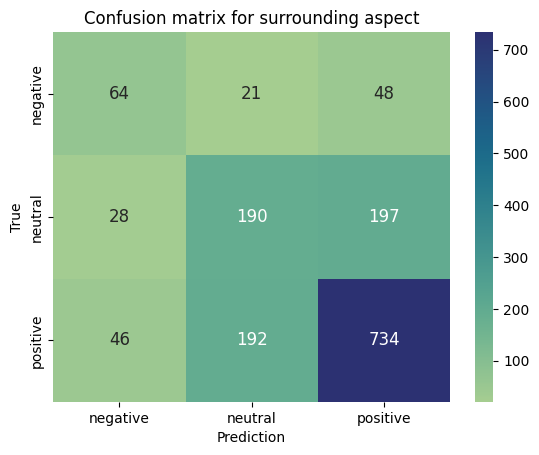
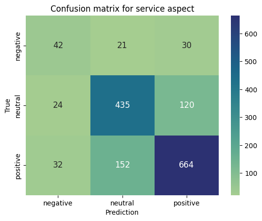
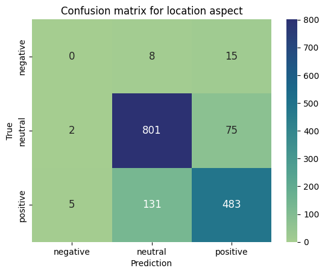
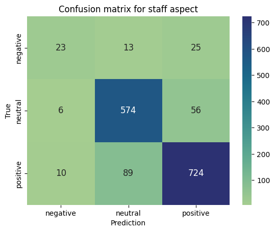
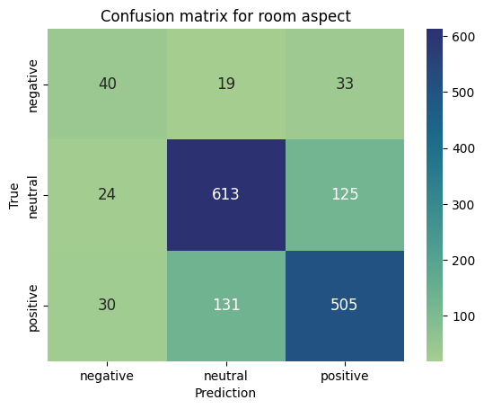
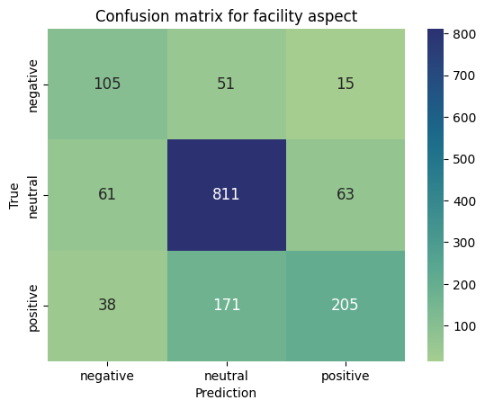
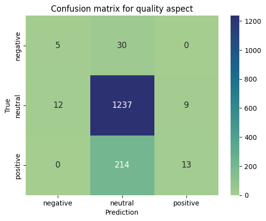
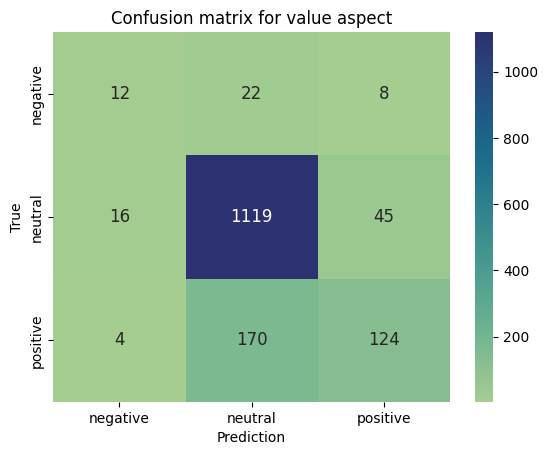

# Description Model
Machine Learning untuk deteksi sentimen aspek pada review hotel
Aspek yang ditentukan adalah sbb:
1. Surrounding (surrounding_sentiment atau aspect-surrounding)
2. Service (service_sentiment atau aspect-service)
3. Meal (Meal_sentiment atau aspect-meal)
4. Location (location_sentiment atau aspect-location)
5. Staff (staff_sentiment atau aspect-staff)
6. Room (room_sentiment atau aspect-room)
7. Facility (facility_sentiment atau aspect-facility)
8. Quality (quality_sentiment atau aspect-quality)
9. Value (value_sentiment atau aspect-value)

Sebelum ditrain dengan model machine learning, data teks (_Features_) nya perlu di cleaning terlebih dahulu seperti 
- Menon-kapitalkan semua teks
- Mengganti baris baru dengan spasi
- Menghapus tanda kutip (') 
- Mengganti strip (-) dengan spasi
- Mengganti yang bukan huruf kecil dengan spasi
- Menghapus semua _stopwords_
- _Steming_ semua kata dalam teks.

Data labelnya juga perlu dibakukan ke 3 label yaitu `positive`, `neutral`, dan `negative`. 

Setelah semua teks berhasil dicleaning, kemudian teksnya perlu divektorisasi yaitu mengubah teks menjadi bentuk yang mudah dipahami oleh mesin yaitu vektor, susunan dari angka-angka bilangan bulat. Teknik yang digunakan untuk vektorisasi teks di model ini adalah dengan _TF-IDF (Term Frequency-Inverse Document Frequency)_ dengan suatu class Python:

        vectorizer = TfidfVectorizer()

Model machine learning ini terbagi menjadi 2 yaitu model untuk sentimen bahasa indonesia dan model untuk sentimen bahasa inggris.

# Developement

Seperti yang kita lihat di atas, ada beberapa metrik evaluasi yang sangat rendah seperti F1-Score dan recall yang sangat kecil pada class negatif. Oleh karena itu disini ada beberapa development model pada folder `dev`. 

## Ruled Based
Pada developedment ini kita akan melakukan developement terutama pada saat model melakukan inferencing atau prediction. Disini kita akan menambahkan metode rule-based selain menggunakan machine learning untuk melakukan inferencing atau prediction sentiment dari suatu teks.

Konsepnya rule basednya adalah kita terlebih dahulu mempunyai dataframe keyword positif dan negatif pada setiap aspek. Kemudian dari sebuah teks, model akan mencari apakah di dalam teks tersebut ada keyword positif atau negatif di setiap aspeknya. Kemudian dari jumlah keyword positif dan negatif akan dihitung scorenya. Scorenya akan dihitung dengan cara jumlah kemunculan Keyword positif akan dikurangin dengan jumlah kemunculan keyword negatif pada setiap aspek. jika score 0, maka modelnya akan menggunakan machine learning yang sudah dilatih untuk melakukan prediksi. Jika scorenya lebih dari 0 maka teks akan diprediksi positif, jika kurang dari 0, maka teks akan diprediksi positif.

Prediksi dengan menggunakan rule based ini merupakan hal optional, bisa tidak menggunakan keyword dalam melakukan prediksi.

### Algoritmanya
1. Pertama perlu membaca dataframe keyword per aspect terlebih dahulu
2. Kemudian, teks nya perlu dihitung scorenya setiap aspek berdasarkan  kemunculan keyword positif dan negatif setiap aspeknya pada teks. yaitu $$ScoreAspect = JumlahKeywordPositif-JumlahKeywordNegatif$$   
3. Setelah itu, dilooping per aspek-nya, jika $ScoreAspect>0$ maka sentimen akan diberikan positif jika  $ScoreAspect<0$ maka sentimen teks langsung dibuat negatif pada aspek tersebut.
4. Jika $ScoreAspect=0$, maka prediksi sentimen pada teks akan dilakukan oleh machine learning yang sudah dilatih.

## Machine Learning

Selain itu disini ada modifikasi sedikit di modelnya. yaitu:
1. Menggabungkan (ensembel) 4 model yaitu `LinearSVC`, `RandomForestClassifier`, `LogisticRegression`, `GradientBoostingClassifier` berdasarkan voting terbanyak (`hard`).
2. Menggunakan *cost-sensitive learning* yaitu `class_weight = 'balanced'`  untuk mengatasi data yang sangat tidak balanced apalagi pada class negatif yang sangat sedikit. konsepnya adalah bobot pelatihan pada label atau *class* yang datanya ;lebih besar sedikit akan diperbesar menyesuaikan data *class* yang lebih banyak.

```py
# Initialize classifiers with balanced class weights and set a random seed for reproducibility
svm = LinearSVC(class_weight=class_weight, dual='auto', random_state=42)
rf = RandomForestClassifier(class_weight=class_weight, random_state=42)
lr = LogisticRegression(multi_class='multinomial', class_weight=class_weight, random_state=42)
gb = GradientBoostingClassifier(random_state=42)

# Combine all models using Voting Classifier
ensemble = VotingClassifier(estimators=[('lr', lr), ('svm', svm), ('rf', rf), ('gb', gb)], voting='hard', n_jobs=-1)
```

# Evaluation
## **Model Bahasa Inggris**
 ### **1. aspect-surrounding**
        
- Accuracy
        
         65.0 %

- classification_report

                        precision    recall  f1-score   support

        negative        0.46      0.48      0.47       133
        neutral         0.47      0.46      0.46       415
        positive        0.75      0.76      0.75       972

        accuracy                            0.65      1520
        macro avg       0.56      0.56      0.56      1520
        weighted avg    0.65      0.65      0.65      1520


- confusion_matrix




### **2. aspect-service**
* Accuracy
 
        75.0657894736842 %

* classification_report
               
                        precision    recall  f1-score   support

        negative          0.43      0.45      0.44        93
        neutral           0.72      0.75      0.73       579
        positive          0.82      0.78      0.80       848

        accuracy                              0.75      1520
        macro avg         0.65      0.66      0.66      1520
        weighted avg      0.75      0.75      0.75      1520


* confusion_matrix


### **3. aspect-meal**
- Accuracy
 
       78.8157894736842 %

- classification_report
               
                        precision    recall  f1-score   support

        negative          0.29      0.24      0.26        70
        neutral           0.83      0.84      0.83       794
        positive          0.79      0.78      0.78       656

        accuracy                               0.79      1520
        macro avg          0.63      0.62      0.63      1520
        weighted avg       0.78      0.79      0.79      1520


- confusion_matrix


### **4. aspect-location**
- Accuracy
 
        84.47368421052632 %

- classification_report
               
                        precision    recall  f1-score   support

        negative          0.00      0.00      0.00        23
        neutral           0.85      0.91      0.88       878
        positive          0.84      0.78      0.81       619

        accuracy                              0.84      1520
        macro avg         0.57      0.56      0.56      1520
        weighted avg      0.84      0.84      0.84      1520


- confusion_matrix
 



### **5. aspect-staff**

- Accuracy
 
        86.90789473684211 %

- classification_report
               
                        precision    recall  f1-score   support

        negative           0.59      0.38      0.46        61
        neutral            0.85      0.90      0.88       636
        positive           0.90      0.88      0.89       823

        accuracy                               0.87      1520
        macro avg          0.78      0.72      0.74      1520
        weighted avg       0.87      0.87      0.87      1520


- confusion_matrix
 

### **6. aspect-room**
- Accuracy
 
        76.18421052631578 %

- classification_report
                
                        precision    recall  f1-score   support

        negative           0.43      0.43      0.43        92
        neutral            0.80      0.80      0.80       762
        positive           0.76      0.76      0.76       666

        accuracy                               0.76      1520
        macro avg          0.66      0.67      0.66      1520
        weighted avg       0.76      0.76      0.76      1520

- confusion_matrix
  

### **7. aspect-facility**
- Accuracy
 
        73.75 %

- classification_report
              
                         precision    recall  f1-score   support

        negative           0.51      0.61      0.56       171
        neutral            0.79      0.87      0.82       935
        positive           0.72      0.50      0.59       414

        accuracy                               0.74      1520
        macro avg          0.67      0.66      0.66      1520
        weighted avg       0.74      0.74      0.73      1520


- confusion_matrix
  


### **8. aspect-quality**
- Accuracy
 
        82.56578947368422 %


- classification_report
               
                         precision    recall  f1-score   support

        negative           0.29      0.14      0.19        35
        neutral            0.84      0.98      0.90      1258
        positive           0.59      0.06      0.10       227

        accuracy                               0.83      1520
        macro avg          0.57      0.39      0.40      1520
        weighted avg       0.79      0.83      0.77      1520


- confusion_matrix
  


### **9. aspect-value**
- Accuracy

        82.56578947368422 %


- classification_report
               
                        precision    recall  f1-score   support

        negative           0.38      0.29      0.32        42
        neutral            0.85      0.95      0.90      1180
        positive           0.70      0.42      0.52       298

        accuracy                               0.83      1520
        macro avg          0.64      0.55      0.58      1520
        weighted avg       0.81      0.83      0.81      1520


- confusion_matrix
   

# How to Run
## Install venv:

```bash 
sudo pip3 install virtualenv
```
##

## create venv with python=3.11:

```bash
virtualenv -p /usr/bin/python3.11 venv
```
##
## active your virtual environment:

```bash
source venv/bin/activate
```
##
## install dependencies:

```bash
pip install -r requirements.txt
```